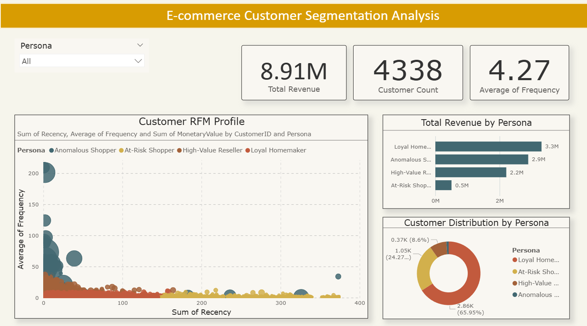

# Advanced Customer Segmentation & Strategy for E-commerce

This project demonstrates a full-cycle, professional data analytics workflow, transforming raw transactional data into a high-impact, actionable strategic plan. The analysis uses a hybrid machine learning model to segment customers and concludes with an interactive Power BI dashboard to present the findings.

**Live Dashboard:** [https://bitmesra-my.sharepoint.com/:u:/g/personal/btech10456_22_bitmesra_ac_in/Ea2i6s8VyhpAhvVidXyQVlwBwJPcu9oLij_292iewOMOXA?e=6XzQk3]

**Dashboard Preview:**
 

---

## Technology & Architecture

This project utilizes a three-tiered architecture to mirror a professional data environment:

* **Data Warehouse & Transformation:** **SQL** (via SQLite) for data storage and calculation of RFM metrics using advanced CTEs.
* **Advanced Analytics & Machine Learning:** **Python** (Pandas, Scikit-learn) for implementing a hybrid DBSCAN + K-Means clustering model and validating the results with a Silhouette Score.
* **Business Intelligence & Storytelling:** **Microsoft Power BI** for creating a fully interactive dashboard that visualizes key insights and strategic recommendations.

---

## Key Findings: Customer Personas

The analysis successfully identified four distinct and statistically significant customer personas:

| Persona | Data Profile |
| :--- | :--- |
| **High-Value Reseller** | Very recent, highly frequent, and high-spending core customers. |
| **Loyal Homemaker** | The largest group of consistent, moderately recent and frequent customers. |
| **At-Risk Shopper** | A large group of customers who have not purchased in a long time and are about to churn. |
| **Anomalous Shopper** | A small, high-value outlier group with erratic buying patterns. |

---

## Actionable Recommendations

Based on the personas, a multi-faceted strategy was developed to enhance customer engagement and maximize revenue:

| Persona | Recommended Action |
| :--- | :--- |
| **High-Value Reseller** | Launch a **"Business Program"** with bulk pricing and exclusive product previews. |
| **Loyal Homemaker** | Introduce personalized **"Smart Bundles"** and a "Subscribe & Save" feature. |
| **At-Risk Shopper** | Execute a targeted **"Win-Back" campaign** with personalized, limited-time offers. |
| **Anomalous Shopper** | **Isolate and Investigate** for potential B2B opportunities or fraudulent activity. |

---

## How to Use This Repository

1.  The Jupyter Notebook `customer_segmentation.ipynb` contains all the Python code for the analysis.
2.  The `rfm_query.sql` file contains the advanced SQL query used for data transformation.
3.  The final `customer_segments_final.csv` dataset is provided to allow for easy reproduction of the Power BI dashboard.